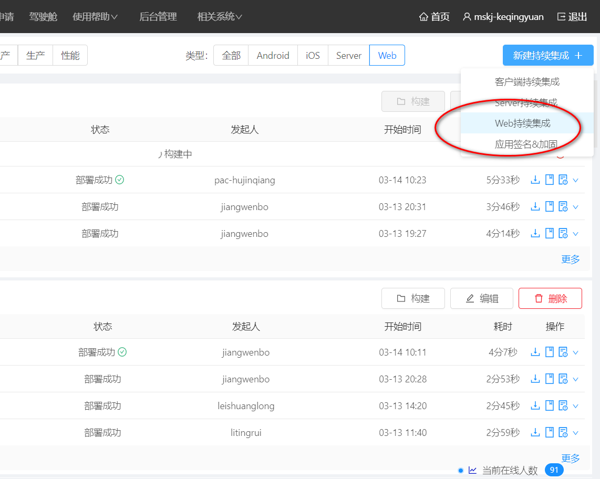
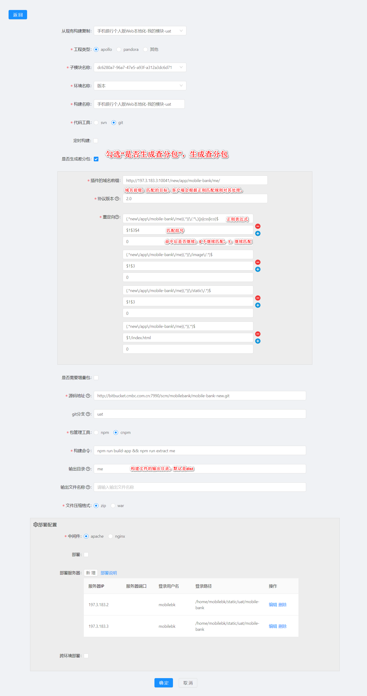

# 构建一个查分包应用

用户第一次登录PSET系统，需要选择你的模块、子模块（没有的话就是默认子模块）和环境创建一个持续构建单元，如下图：

笔者选择了WEB构建，进入到新建构建界面，需要用户输入必要的构建信息，如下图是一个WEB构建的新建页面，
需要注意的是如果您这个构建需要打出差分包，必须勾中“是否生成查分包”选项。如果您还想把您的全量包在
成功构建后部署到您的服务器，您可以在“部署配置”里写上您的服务器配置信息。需要注意的是PSET平台WEB部署
采用公钥体系的加密方式，如果您第一次配置该服务器，您需要把我们的公钥添加到您的服务器中，并且告知[胡稳安](mailto:huwenan@cmbc.com.cn)
让他把您的服务器添加到PSET授信列表。

