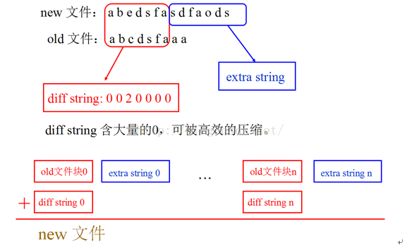
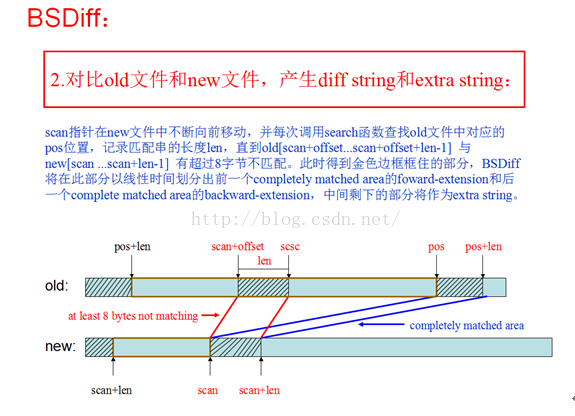
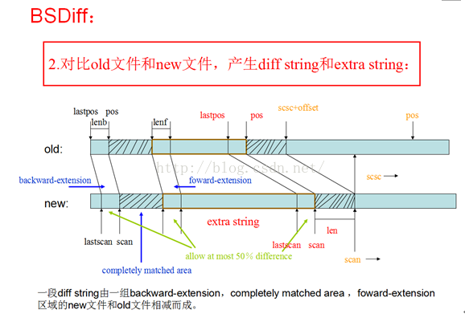
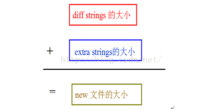
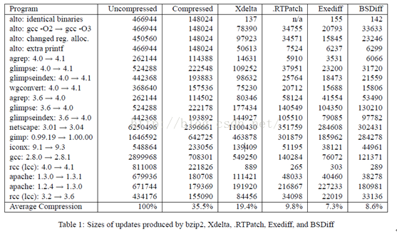

# diff介绍

BSDiff是一个差量更新算法，它在服务器端运行BSDiff算法产生patch包，在客户端运行BSPatch算法，将旧文件和patch包合成新文件。

### 差量更新算法的核心思想

尽可能多的利用old文件中已有的内容，尽可能少的加入新的内容来构建new文件。通常的做法是对old文件和new文件做子字符串匹配或使用hash技术，提取公共部分，将new文件中剩余的部分打包成patch包，在Patch阶段中，用copying和insertion两个基本操作即可将old文件和patch包合成new文件。
 
### BSDiff算法的改进

Insertion操作会引起大量的指针变动和修改，要记录这些值才能在Patch阶段给修改过的区域重新定位，由于这些指针控制字必须在BSDiff阶段加入patch包，产生的patch包会较大。BSDiff通过引入diff string的概念，大大减少了要记录的指针控制字的数目，从而使得patch包更小。

### 基本定义

### BSDiff基本步骤

BSDiff的三个基本步骤如下：

1．对old文件中所有子字符串形成一个字典；

2．对比old文件和new文件，产生diffstring和extra string；

3．将diffstring 和extra string 以及相应的控制字用zip压缩成一个patch包。

步骤1.是所有差量更新算法的瓶颈，时间复杂度为O(nlogn),空间复杂度为O(n)，n为old文件的长度。BSDiff采用 Faster suffix sorting方法获得一个字典序，使用了类似于快速排序的二分思想，使用了bucket，I，V三个辅助数组。最终得到一个数组I，记录了以前缀分组的各个字符串组的最后一个字符串在old中的开始位置

步骤2.是BSDiff产生patch包的核心部分，详细描述如下：

步骤3.将diff string 和extrastring 以及相应的控制字用zip压缩成一个patch包。

### BSPatch基本步骤

客户端合成patch的基本步骤如下：

1.接收patch包

2.解压patch包

3.还原new文件

三个步骤同时在O（m）时间内完成，但在时间常数上更依赖于解压patch包的部分，m为新文件的长度
 
复杂度分析

根据以上步骤，不难得出BSDiff与BSPatch的时间与空间复杂度如下：

BSDiff

时间复杂度  O(nlogn)  空间复杂度 O(n)

BSPatch

时间复杂度  O(n+m)   空间复杂度  O(n+m)
 
另外给出BSDiff压缩效率实验数据：

``图片来源：CompressingDifferences of Executable Code``

>参考文献
>
> [Naïve Differences of ExecutableCode](https://www.researchgate.net/publication/2890146_Naive_Differences_of_Executable_Code)
>
> [Compressing Differences ofExecutable Code](https://www.researchgate.net/publication/2379631_Compressing_Differences_of_Executable_Code)
